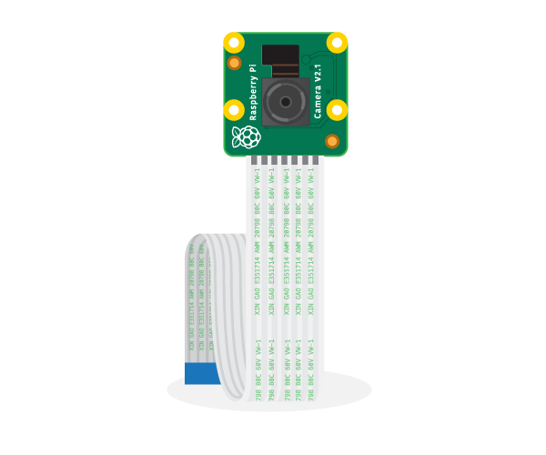
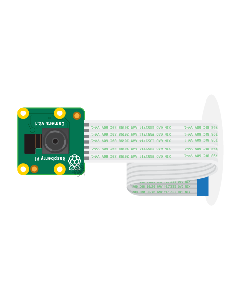
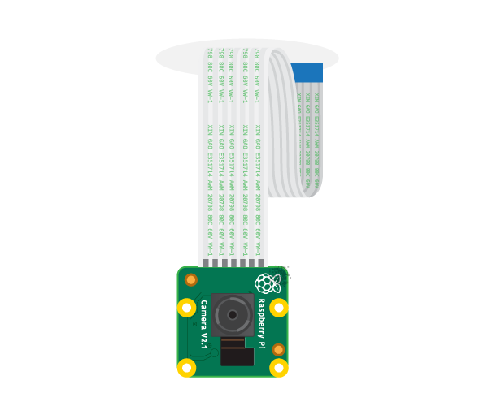
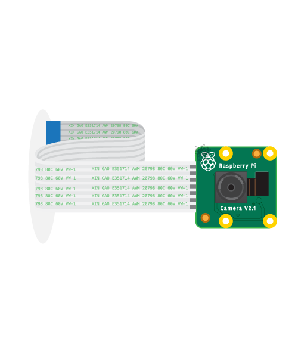
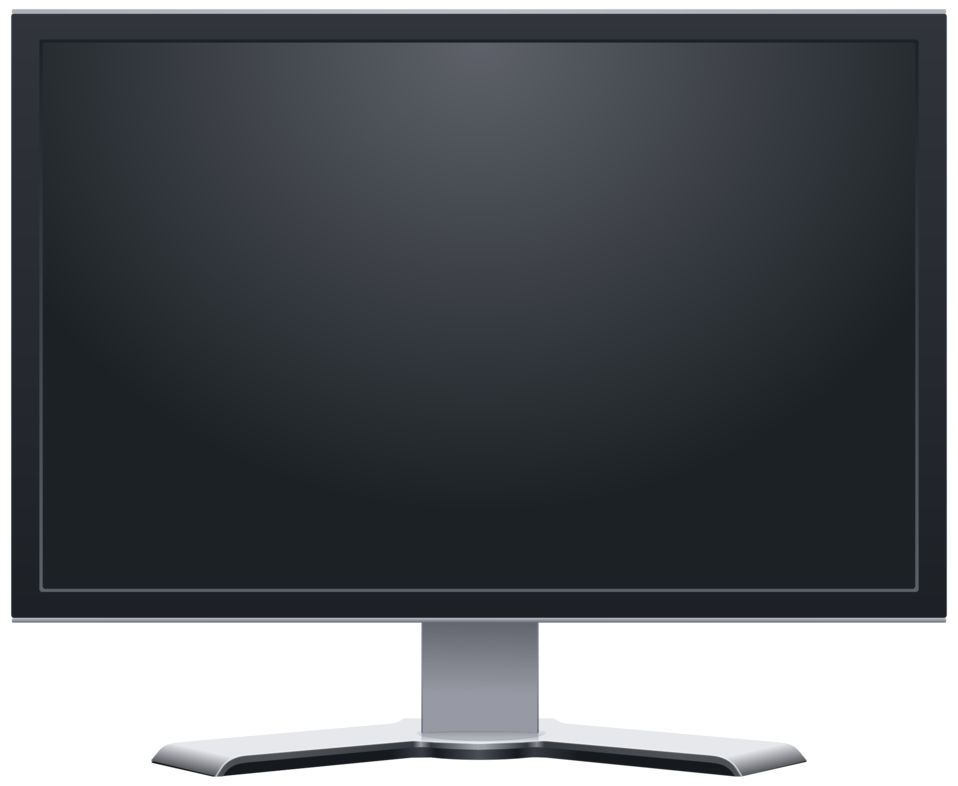
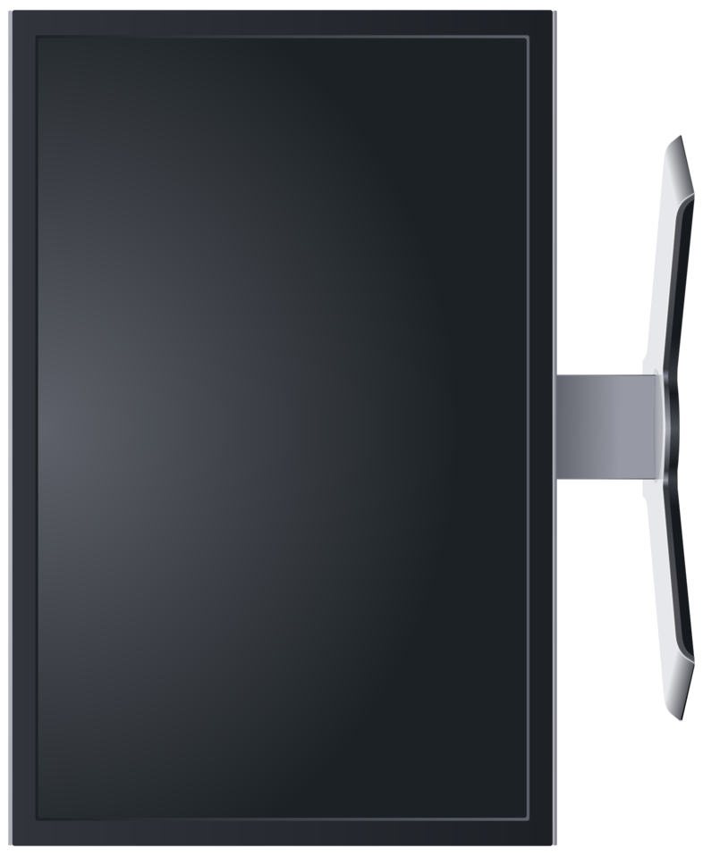
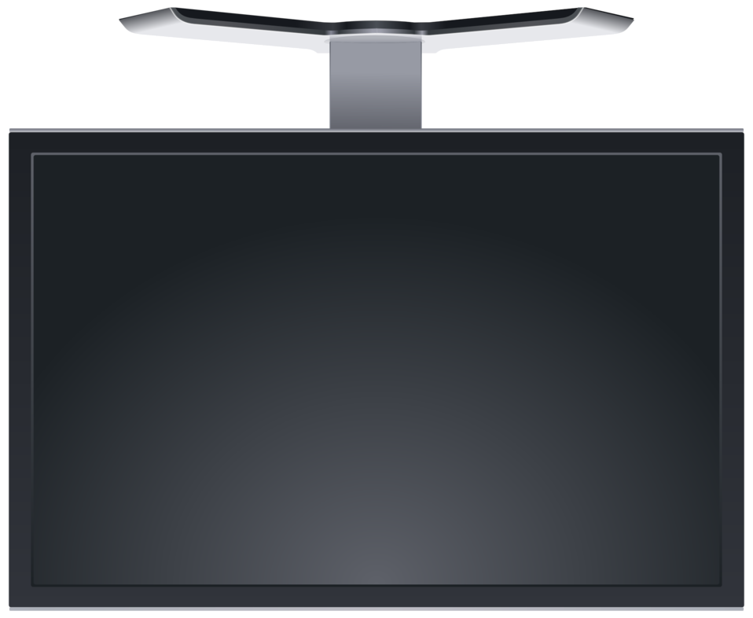
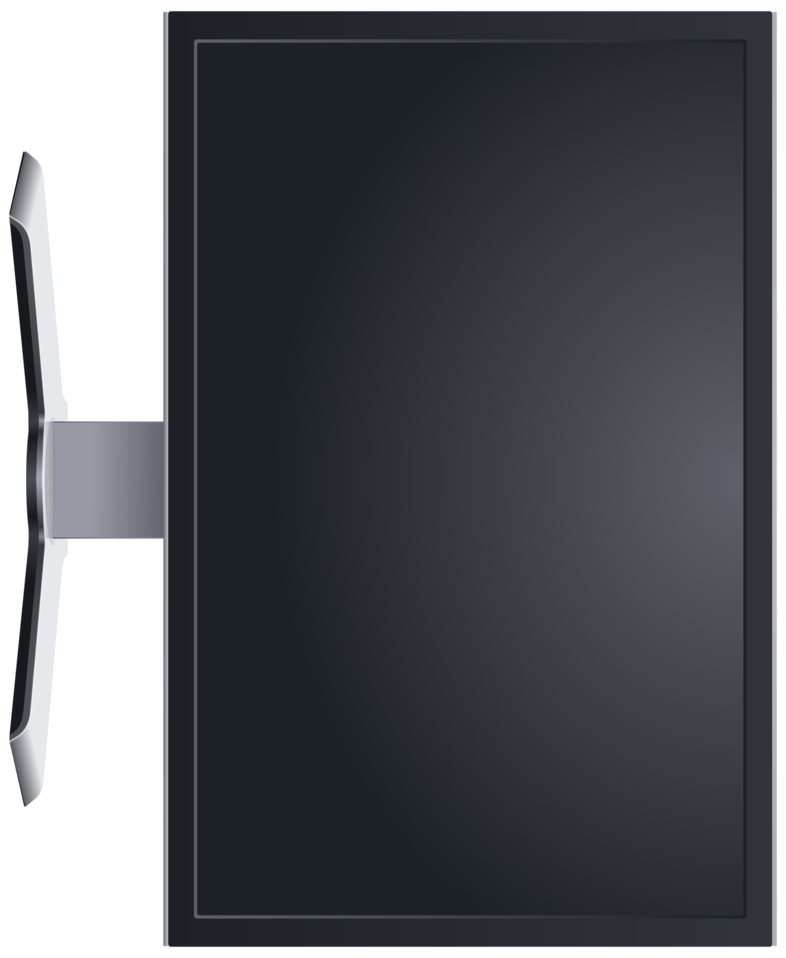

# Zombie Mirror

Zombie Mirror is a project created by Ben Rush and Josh Brown Kramer for Halloween 2019.  Look into the Zombie Mirror, wait for it to find your face, and ... POOF! ... you're a Zombie.  It's a lot of fun at parties.[PICTURES NEEDED]

Behind the scenes, Zombie Mirror consists of a monitor or TV connected to a Raspberry Pi running a program that finds faces.  If it finds one, it sends it up to DeepGrave.me (also created by Josh and Ben) which uses a type of deep neural network called a CycleGAN to zombify the face.

This is the repo for the Raspberry Pi side of the Zombie Mirror project.  If you would like to create your own, follow the instructions below to set up the Raspberry Pi, and see the Instructables page [LINK TO INSTRUCTABLES PAGE] for the rest.

## Required Materials

The following will be part of the final build.
- [Raspberry Pi](https://www.raspberrypi.org/products/).  Note, this build has been tested on a Rasberry Pi 3 Model B+, but it will likely work with other configurations.
- [Raspberry Pi Camera Module](https://www.raspberrypi.org/products/camera-module-v2/) or a web cam.  We've tested with the Camera Module V2.
- [Power supply](https://www.raspberrypi.org/products/raspberry-pi-universal-power-supply/).  Must be 5V, at least 2.5Amps, and end in Micro USB.
- MicroSD Card.
- HDMI Cable
- A monitor or TV that supports HDMI

While setting up, you'll also want 
- A USB Keyboard
- A USB Mouse.
- An SD Card Reader

## Steps

### Put the Zombie Mirror software on the Raspberry Pi
1. Follow [the instructions from raspberrypi.org to set up your Raspberry Pi](https://projects.raspberrypi.org/en/projects/raspberry-pi-setting-up/).
2. Follow [the instructions from raspberrypi.org to set up the pi camera](https://www.raspberrypi.org/documentation/configuration/camera.md).  Or plug in your USB web cam.
4. Open a terminal
3. Clone this repo
```
git clone https://github.com/kwende/Halloween/
```
4. Navigate to the pi directory of the repo
```
cd Halloween/pi
```
5. Install required pacakages
```
pip3 install -r requirements.txt
```
6. Test
```
python3 ui.py
```
7. Press q to exit

### Configure Raspberry Pi to boot into Zombie Mirror
1. Navigate to `~/.config/lxsession/LXDE-pi`
```
cd ~/.config/lxsession/LXDE-pi
```
2. Open the autostart file in that folder:
```
sudo nano autostart
```
3. Navigate to the bottom of the file and add the following line.
```
@python3 /home/pi/Halloween/pi/ui.py
```
4. Save and exit: <kbd>Ctrl+X</kbd>, <kbd>Y</kbd>, <kbd>Enter</kbd>
5. Restart your Raspberry Pi

### Configure Raspberry Pi To Not Sleep
1. Open a root terminal in raspberry Pi. Now  you need to edit your script that's starting X. In the default build with lightdm.

2. Open "lightdm.conf" file located in, 

     /etc/lightdm/lightdm.conf

3. Add the following line to `Seat:*` section.

     [Seat:*]
     
     xserver-command=X -s 0 -dpms

4. Restart your Raspberry Pi.

Source: https://raspberrypi.stackexchange.com/questions/4773/raspberry-pi-sleep-mode-how-to-avoid

### Optional Configuration

Here is an example that runs the ui with default settings.  Details of each configuration appear below.

```
python3 ui.py --cameraorientation 180 --displayorientation 270 --mirrored False --minfacesize 128 --zombietime 5 --fontsize 128 --cameraresolution 1280x720 --webtimeout 6
```

- `--cameraorientation`.  Use this argument to indicate how the camera is oriented.  Default is 180.
     
|  |  |  |  |
|---|---|---|---|
| `python3 ui.py --cameraorientation 0` | `python3 ui.py --cameraorientation 90`  | `python3 ui.py --cameraorientation 180`  | `python3 ui.py --cameraorientation 270` |

- `--displayorientation`.  Use this argument to indicate how the monitor/TV is oriented.  Default is 270.
     
|  |  |  |  |
|---|---|---|---|
| `python3 ui.py --displayorientation 0` | `python3 ui.py --displayorientation 90`  | `python3 ui.py --displayorientation 180`  | `python3 ui.py --displayorientation 270` |

- `--mirrored`. Configure True if unaltered image from the camera is mirrored.  Default is False.
- `--minfacesize`. set this smaller if the mirror tells you to move closer but you're already close.  Default is 128.
- `--zombietime`. amount of time, in seconds, to display the zombie image.  Default is 5.
- `--fontsize`.  How large the font is.  Default is 128.
- `--cameraresolution`.  Desired camera resolution.  Default is "1280x720".  Set it smaller if you want the framerate to be higher.
- `--webtimeout`.  Time in seconds to wait for zombie image before timing out.

## Not ready for prime time:
Think this is minimal install of Pillow:
sudo apt-get install libjpeg-dev
pip install Pillow


sudo apt-get install libjasper-dev
sudo apt-get install libqtgui4
install libqt4-test


Maybe need this:
PIL : https://community.dur.ac.uk/m.j.r.bordewich/rpi/Raspberry%20Pi%20Notes.pdf
